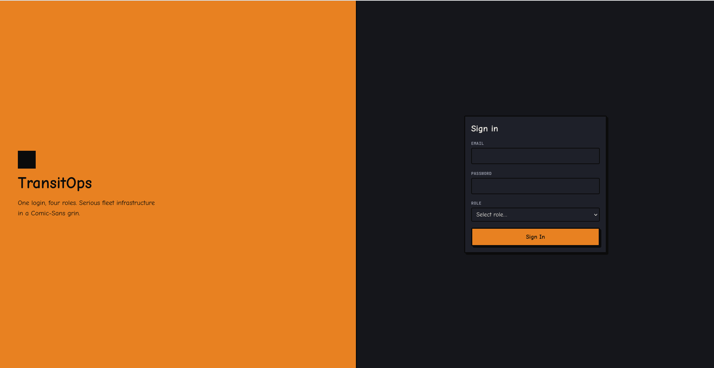
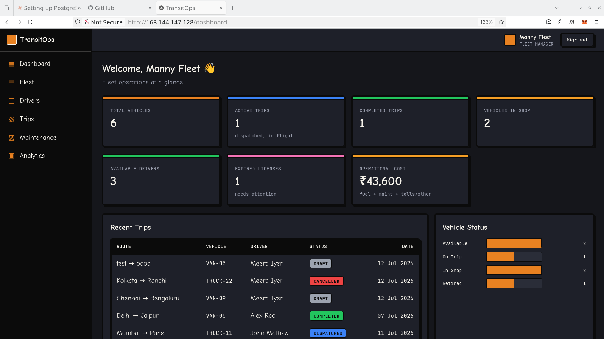
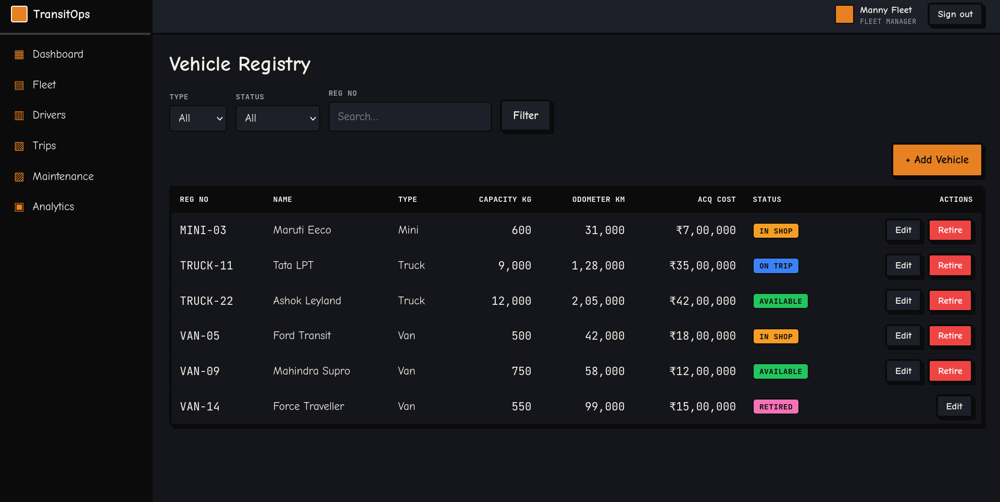
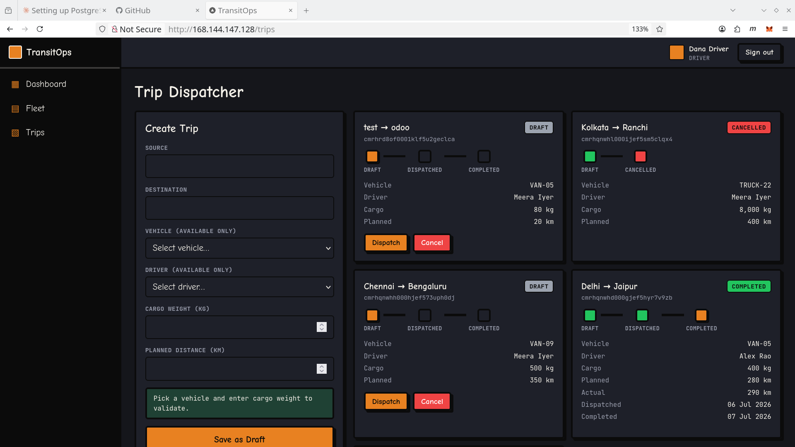
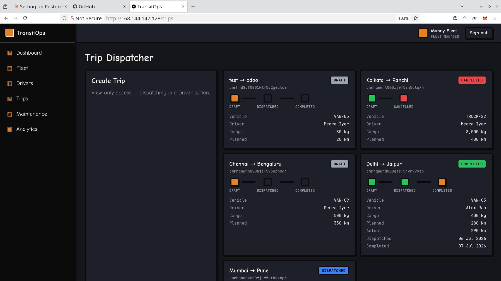
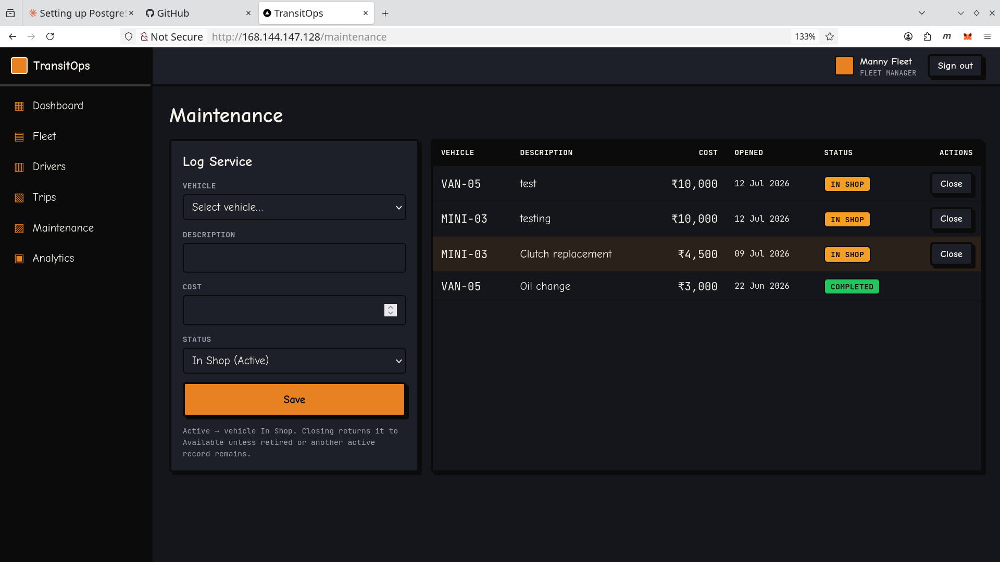
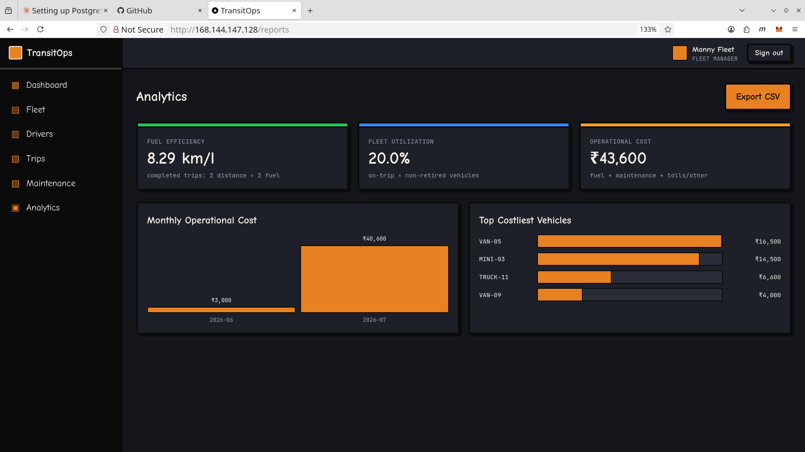

# 🚚 TransitOps

**Smart Transport Operations Platform** — a role-gated, rule-enforcing web app managing the full transport lifecycle: vehicles, drivers, dispatch, maintenance, fuel & expenses, with live operational insight.

Neo-brutalist dark cockpit with Comic Sans — playful on the surface, rigorous underneath.

`Next.js 16` · `React 19` · `TypeScript` · `Tailwind v4` · `Prisma 7 + PostgreSQL` · `Auth.js`

---

## 🔗 Live Demo

**[transit-odoo.gollabharath.me](http://transit-odoo.gollabharath.me)** · [http://168.144.147.128](http://168.144.147.128)

> Deployed on a **DigitalOcean** droplet (Docker + PostgreSQL).

### Test credentials — password `transit123` for all

| Role | Email |
|---|---|
| Fleet Manager | `manager@transitops.dev` |
| Driver | `driver@transitops.dev` |
| Safety Officer | `safety@transitops.dev` |
| Financial Analyst | `finance@transitops.dev` |

---

## ✨ Features

- **Responsive UI** — desktop rail + mobile drawer, adaptive grids
- **Auth + RBAC** — one login, four roles; route + server-action guards
- **Vehicle & Driver CRUD** — with lifecycle rules (retire, license validity)
- **Trip management** — cargo/capacity, availability & license validations
- **Automatic status transitions** — dispatch/complete/cancel flip trip ↔ vehicle ↔ driver in one transaction; odometer + fuel log auto-updated
- **Maintenance workflow** — active record sends vehicle to shop, close restores it
- **Fuel & Expense tracking** — logs roll up into operational cost
- **Dashboard KPIs** — 7 live metrics + recent activity

## 📸 Screenshots

| | |
|---|---|
|  |  |
| **Login** | **Fleet Dashboard KPIs** |
|  |  |
| **Vehicle Registry** | **Driver — Trip Creation** |
|  |  |
| **Trip Dispatcher** | **Maintenance Board** |
|  | |
| **Analytics** | |

## 👥 Four roles, one login

| Role | Owns |
|---|---|
| **Fleet Manager** | Fleet assets, maintenance, vehicle lifecycle, analytics |
| **Driver** | Trip creation, dispatch, live delivery monitoring |
| **Safety Officer** | Driver compliance, license validity, safety scores |
| **Financial Analyst** | Expenses, fuel, maintenance & operational cost |

## 🛠 Local setup

Requires Docker (Postgres) and Node.

```bash
docker compose up -d          # Postgres 16 on :5432
cp .env.example .env          # set AUTH_SECRET
npm install
npm run db:migrate            # migrations + generate client
npm run db:seed               # demo data (4 users, 6 vehicles, 5 drivers, 4 trips)
npm run dev                   # http://localhost:3000
```

## 📜 Scripts

| Command | Does |
|---|---|
| `npm run dev` | Dev server |
| `npm run build` / `start` | Production build / serve |
| `npm run lint` / `typecheck` | ESLint / `tsc --noEmit` |
| `npm run db:migrate` / `db:seed` | Migrate / seed |
| `npm run db:studio` / `db:reset` | Prisma Studio / reset |

## 📂 Layout

`src/app` routes + role route-groups · `src/components` UI + feature forms · `src/core` db/security/RBAC/errors · `src/modules` per-entity service/repository/Zod schema · `prisma/` schema/migrations/seed. Full spec in `plan.md`.
